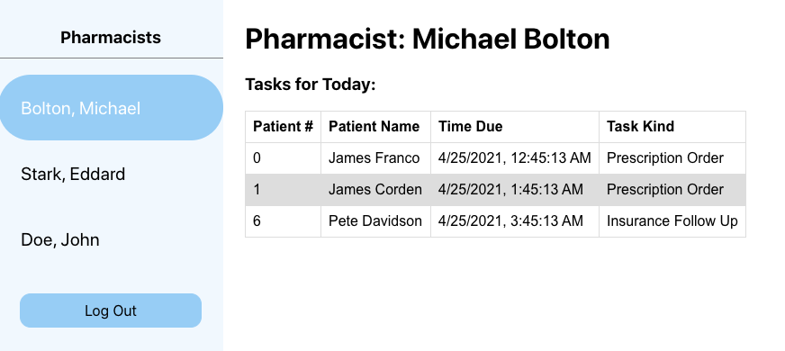

## Getting started

There's a few things you need to get started on to get this to work.

### 1. Installing minimum dependencies

Make sure you have `node` installed, with a version greater than `7.0.0`.

Once you have a good `node` installed, run `npm install` in this repo to get your dependencies.

### 2. Serving your app

By default, you can run `npm start` to run your app, serving the files from `/public`.

### 3. Running the api server

We have provided a simple api server for you. 

Rename server.txt to server.js 
(Gmail does not like .js in attachment)

You can run `npm run api-server` to start it.

localhost server is:
localhost:8080

The endpoints are

- GET `/api/tasks`
	- Returns a list of `task`s. An example task is provided below.
	```
	{
		"id": 0,
		"pharmacist": {
		"id": 0,
		"name": {
			"first": "Michael",
			"last": "Bolton"
		}
		},
		"patient": {
		"id": 0,
		"name": {
			"first": "James",
			"last": "Franco"
		}
		},
		"taskTs": "2021-04-25T07:45:13.763Z",
		"type": "Prescription Order"
	}
- GET `/api/pharmacists`
	- Returns a list of `pharmacist`s. An example pharmacist is provided below. Note that the `pharmacist` is also contained within a `task`.
	```
	{
		"id": 0,
		"name": {
			"first": "Michael",
			"last": "Bolton"
		}
	}

### 4. The task

Using the api provided, create a simple app that roughly looks like:



You can use any JS framework you like, but React is preferred. 

Specifications:
- A sidebar containing a list of selectable `pharmacist`s and a log out button. When a `pharmacist` is selected, show the relevant tasks the pharmacist has. For now, no need to worry about the actual log in functionality.
- A main table containing the `Patient #`, `Patient Name`, `Time Due`, and `Task Kind` -- these data are provided in the `task` endpoint.
